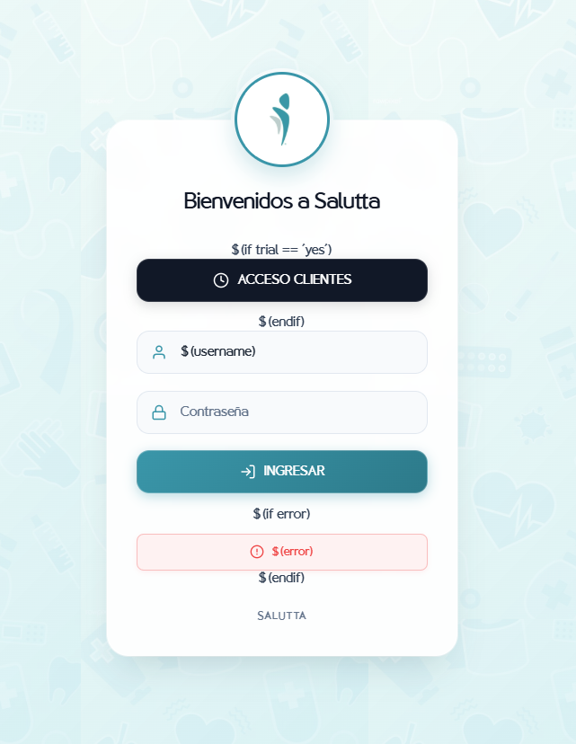

# 🌐 Hotspot Salutta - Portal Cautivo MikroTik

Plantilla moderna y responsiva de portal cautivo (Hotspot) para routers **MikroTik RouterOS**, diseñada a medida para la identidad visual de **Salutta**.

Incorpora una interfaz estilo *Glassmorphism*, paleta de colores corporativa (#3A96A9), soporte para autenticación segura (CHAP / PAP), acceso de prueba para clientes e integración visual optimizada para dispositivos móviles y de escritorio.

---

## 📸 Vista Previa

<div align="center">
  
  <p><em>Pantalla principal de inicio de sesión en dispositivos móviles</em></p>
</div>

---

## ✨ Características Principales

- **Diseño Moderno & Elegante**: Efecto de desenfoque translúcido (*Glassmorphism*), sombras suaves y tarjetas flotantes.
- **Identidad de Marca**: Fondo temático médico/salud (`backsalut.jpg`), logo flotante circular (`log.jpg`) y tipografía personalizada (`Osande`).
- **Acceso Clientes / Invitados (Trial)**: Botón de conexión rápida con 1 solo clic (`ACCESO CLIENTES`) mediante el sistema de prueba de MikroTik.
- **Autenticación Segura (CHAP / PAP)**: Integración con encriptación MD5 en cliente (`md5.js`) para evitar el envío de credenciales en texto plano.
- **Visualización Completa de Estados**:
  - **Login (`login.html`)**: Formulario estilizado con iconos SVG y mensajes de error dinámicos.
  - **Estado (`status.html`)**: Monitoreo en tiempo real de IP asignada, consumo de datos (subida/bajada), tiempo conectado y botón para desconectar.
  - **Desconexión (`logout.html`)**: Resumen detallado de la sesión finalizada y botón de reconexión rápida.
  - **Redirección (`alogin.html`)**: Pantalla de carga animada que redirige automáticamente a las redes sociales del negocio (Instagram [@saluttave](https://www.instagram.com/saluttave/?hl=es)).
  - **Errores (`error.html` y `errors.txt`)**: Notificaciones claras ante credenciales inválidas, límite de sesiones o desconexión del servicio.
- **100% Responsivo**: Adaptado perfectamente para teléfonos inteligentes (iOS y Android), tablets y computadoras portátiles.

---

## 📁 Estructura del Proyecto

```text
hostpot-salutta/
├── login.html               # Página principal de inicio de sesión
├── status.html              # Estado de la conexión y consumo en tiempo real
├── logout.html              # Confirmación y estadísticas al cerrar sesión
├── alogin.html              # Pantalla de carga y redirección post-login
├── error.html               # Página de error amigable para el usuario
├── errors.txt               # Personalización de mensajes de error de RouterOS
├── radvert.html             # Gestión de anuncios publicitarios (si aplica)
├── redirect.html            # Redirección de URLs
├── rlogin.html              # Redirección WISP / XML
├── login.css                # Hoja de estilos general y reglas responsive
├── md5.js                   # Algoritmo de encriptación CHAP para MikroTik
├── log.jpg                  # Isotipo / logotipo de Salutta
├── backsalut.jpg            # Fondo con patrón temático médico
├── Osande - Medium DEMO.ttf # Tipografía corporativa incrustada
├── salutta.png              # Captura de pantalla de la interfaz
└── README.md                # Documentación del proyecto
```

---

## 🚀 Instalación en MikroTik RouterOS

### Paso 1: Subir los Archivos al Router
1. Abre **Winbox** y conéctate a tu router MikroTik.
2. Dirígete a la sección **Files** en el menú izquierdo.
3. Arrastra la carpeta del proyecto (o su contenido) dentro del directorio `flash/` o la raíz de archivos de MikroTik. Se recomienda nombrarla, por ejemplo: `hotspot-salutta`.

*(También puedes subir los archivos mediante un cliente FTP como FileZilla apuntando a la IP de tu router).*

### Paso 2: Configurar el Perfil de Hotspot
1. En Winbox, ve a **IP** > **Hotspot** > pestaña **Server Profiles**.
2. Haz doble clic en el perfil de tu Hotspot (ej. `hsprof1`).
3. En la pestaña **General**, ubica el campo **HTML Directory**.
4. Selecciona la carpeta donde subiste los archivos (por ejemplo `hotspot-salutta` o `flash/hotspot-salutta`).
5. En la pestaña **Login**, asegúrate de habilitar los métodos que desees utilizar (ej. **HTTP CHAP**, **HTTP PAP** y **Trial** si habilitas el botón de acceso libre a clientes).
6. Haz clic en **Apply** y **OK**.

---

## 🎨 Paleta de Colores

| Color | Código Hex | Uso |
|---|---|---|
| **Principal** | `#3A96A9` | Botones de acción, enlaces, iconos activos |
| **Hover / Primario Suave** | `#4EA8BB` / `#6AC0D1` | Estados interactivos y resaltados |
| **Primario Oscuro** | `#2D7A8A` | Estados activos/presionados de botones |
| **Fondo Oscuro Botón** | `#111827` | Botón "ACCESO CLIENTES" |
| **Alerta de Error** | `#EF4444` | Mensajes de advertencia y errores |
| **Fondo Tarjeta** | `rgba(255, 255, 255, 0.94)` | Efecto Glassmorphism translúcido |

---

## 📄 Licencia y Créditos

Desarrollado para la red Wi-Fi de **Salutta**. Todos los derechos de marca y diseño pertenecen a sus respectivos propietarios.
